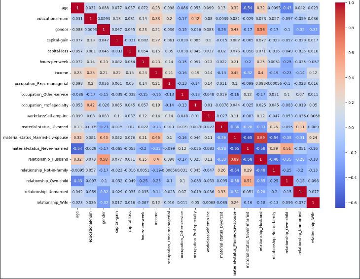

# Income Predictor

## Project Overview

The "Income Predictor" is a data analysis and machine learning project developed using Python in a Jupyter Notebook environment. The project utilizes the Pandas library to process a dataset for predicting whether individuals earn more or less than $50k annually based on demographic and employment features.

## Features

- **Data Preparation**: Cleansing and preparing the data for analysis using Pandas.
- **Exploratory Data Analysis (EDA)**: Analyzing the dataset to understand patterns and relationships.
- **Heatmap Visualization**: Creating a heatmap to identify the variables most correlated with income levels.
- **Feature Engineering**: Selecting the most impactful features to improve model accuracy.
- **Decision Tree Classifier**: Implementing a Decision Tree algorithm to predict income categories.

## Data Handling

Initial data cleaning processes were applied to handle missing values and anomalies. EDA was performed to explore data characteristics and relationships. A heatmap was generated to visualize the strength of correlations between different features and the target variable.

 

## Tools Used

- **Pandas**: For data manipulation and analysis.
- **Jupyter Notebook**: Interactive coding and visualization.
- **Scikit-learn**: Machine learning library used for implementing the Decision Tree model.
- **Matplotlib & Seaborn**: Libraries used for creating the heatmap and other visualizations.

## Model Development

A Decision Tree classifier was employed to model the prediction of income levels. The model was trained and validated with the selected features, and its predictive performance was assessed.

## Getting Started

To explore the dashboard:
1. Clone the repository to your local machine.
2. Open the `.ipynb` file with Jupyter Notebook.
3. Run the cells in sequence to view the data cleaning, analysis, and predictive modeling process.

## Contributions

Contributions are welcome! If you have suggestions or improvements, please fork the repository and submit a pull request.

## Contact

For any further queries or discussions, feel free to contact me at acampagioria@gmail.com.

Thank you for exploring the Income Predictor. Your feedback and contributions can help to further improve the predictive analysis of income levels!

